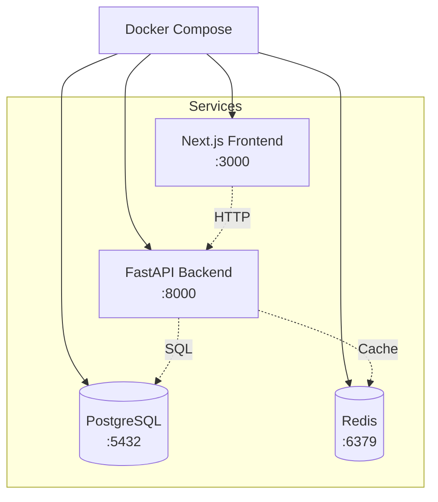
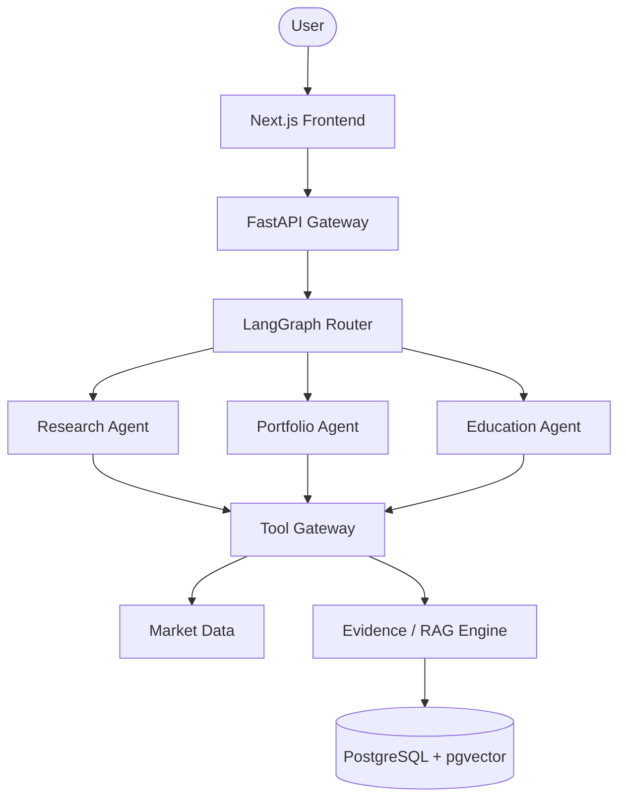

# FinMitra 2.0 Architecture

## Phase 0: Infrastructure

```mermaid
graph TD
    Compose[Docker Compose]
    
    subgraph Services
        Web[Next.js Frontend\n:3000]
        API[FastAPI Backend\n:8000]
        Postgres[(PostgreSQL\n:5432)]
        Redis[(Redis\n:6379)]
    end
    
    Compose --> Web
    Compose --> API
    Compose --> Postgres
    Compose --> Redis
    
    Web -.->|HTTP| API
    API -.->|SQL| Postgres
    API -.->|Cache| Redis
```

## Final Target Architecture

```mermaid
graph TD
    User([User]) --> Web[Next.js Frontend]
    Web --> API[FastAPI Gateway]
    
    API --> Agent[LangGraph Router]
    
    Agent --> RA[Research Agent]
    Agent --> PA[Portfolio Agent]
    Agent --> EA[Education Agent]
    
    RA --> Tools[Tool Gateway]
    PA --> Tools
    EA --> Tools
    
    Tools --> Market[Market Data]
    Tools --> Evidence[Evidence / RAG Engine]
    
    Evidence --> Postgres[(PostgreSQL + pgvector)]
```
