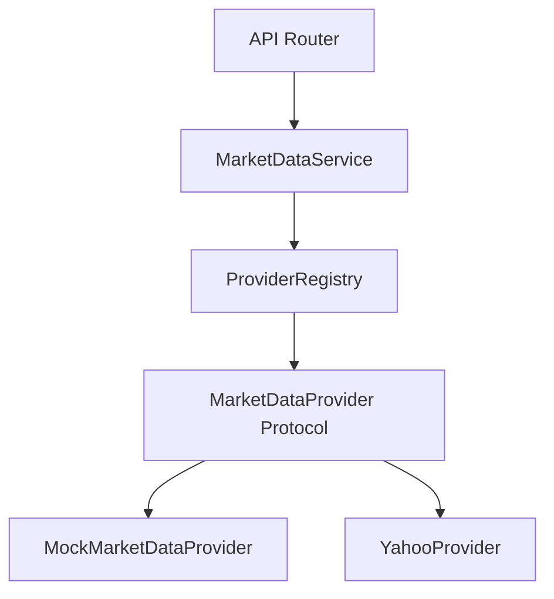

# Market Data Abstraction

## Overview
The Market Data subsystem in FinMitra 2.0 provides a provider-independent interface for fetching market information (quotes, historical prices, company profiles, and financial metrics). 
This abstraction guarantees that FinMitra agents, portfolio engines, and services remain decoupled from the specifics of any single third-party provider (e.g., Yahoo Finance).

## Architecture

### Components

1. **MarketDataProvider Protocol**: 
   An abstract interface defining `get_quote`, `get_historical_prices`, `get_company_profile`, and `get_financial_metrics`.

2. **ProviderRegistry**: 
   A central registry that loads providers by string identifiers (`mock`, `yahoo`). It allows dynamic provider injection based on environment variables.

3. **MarketDataService**: 
   The application service responsible for:
   - Validating and normalizing symbols
   - Selecting the appropriate provider from the registry
   - Catching provider-specific exceptions and re-raising them as standardized domain exceptions
   - Ensuring the data returned matches the internal FinMitra Pydantic schemas

4. **Internal Schemas**:
   Defined in `app/schemas/market_data.py`, these schemas ensure that regardless of the provider, FinMitra components always interact with the same deterministic data structure. Examples include `Quote`, `HistoricalPrice`, `CompanyProfile`, and `FinancialMetrics`.

## Data Freshness & Caching
Each market data object tracks its freshness using:
- `data_timestamp`: When the data point actually occurred in the market.
- `retrieved_at`: When FinMitra fetched the data from the provider.

**Note on Caching**: 
A caching layer (e.g., Redis) is intentionally deferred to the performance phase. When introduced, it will wrap the `MarketDataService` or sit between the Service and the Provider, preventing excessive rate limits from external APIs.

## Symbol Normalization
Currently, FinMitra defaults to uppercase symbols. To accommodate external providers (like Yahoo Finance) requesting suffixes for non-US markets, the `MarketDataService` implements lightweight suffix injection (e.g., appending `.NS` for Indian equities defaulting to the National Stock Exchange) prior to provider delegation.
